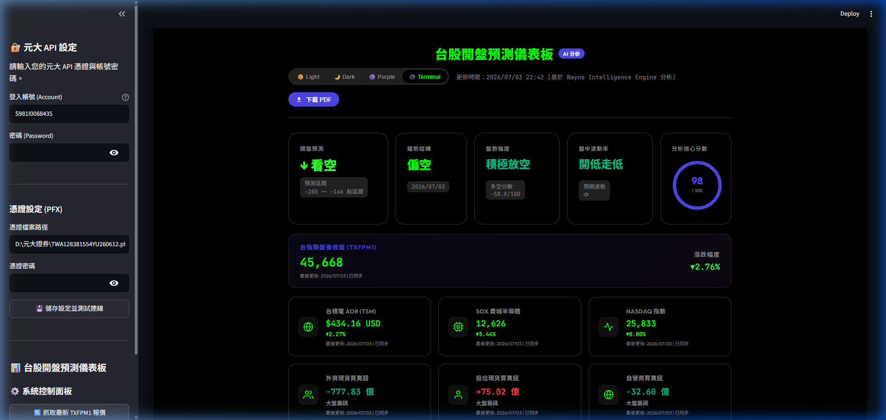
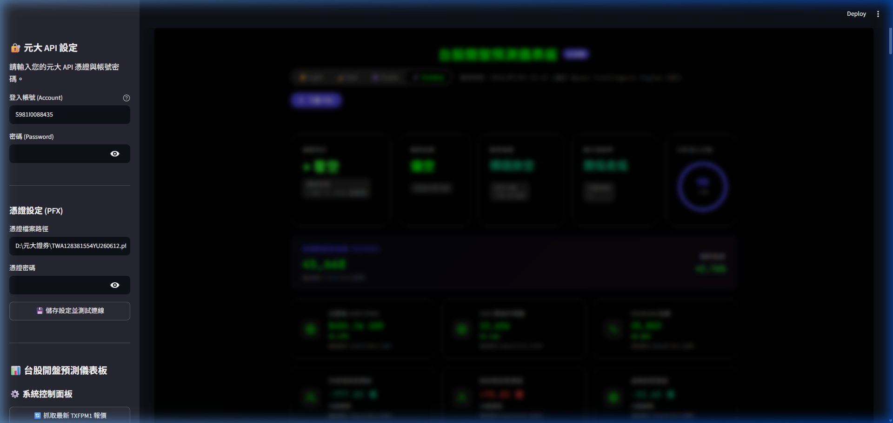

# 🇹🇼 台股開盤預測儀表板 (Taiwan Stock Opening Forecast Dashboard)

[](https://opensource.org/licenses/MIT)
[](https://www.python.org/)
[](https://streamlit.io/)

這是一個專業級別的台股開盤預測與多維量化決策平台。系統結合了 **元大證券 SparkAPI**、**台灣證券交易所 (TWSE) OpenAPI**、**台灣期貨交易所 (TAIFEX)**、**Yahoo Finance** 等多重數據源，利用**本機四層量化規則決策大腦**與 **AI 大型語言模型** 進行交叉預測，提供一鍵導出 PDF 報告、多主題切換、指標 Hover Tooltips 以及自動同步 Notion 資料庫等全方位功能。

---

## 🌟 核心特色

1. 💻 **Streamlit 專業控制台**：整合元大 API 登入、憑證測試連線、夜盤報價抓取及完整預測流程執行於單一介面。
2. 🎨 **動態主題引擎 (Theme Engine)**：一鍵切換四種高品質視覺風格：
   * 🌞 **Light**（白天模式，適合列印與 PDF 匯出）
   * 🌙 **Dark**（TradingView / Bloomberg 黑底質感風格）
   * 🟣 **Professional Purple**（迎合科技感的專業紫色品牌色系）
   * ⚫ **Terminal Mode**（高對比度專業交易終端黑綠風格）
3. 📊 **多維指標卡片群**：16 張卡片完整覆蓋全球市場、大盤籌碼及期指部位，全部卡片均具備：
   * 主要與替代數據源自動切換與同步狀態監控。
   * 滑鼠懸停（Hover）原生披露數據來源、API 名稱、時間與狀態的 Tooltips。
   * 點擊直接以新分頁跳轉至該指標在玩股網、Yahoo Finance、證交所等對應的真實資料採集網頁。
4. 🖨️ **一鍵下載 PDF 報告**：運用 html2pdf.js 與前端跨域 iframe postMessage 通信，一鍵產生並下載高解析度無裁切的 PDF 分析報告。
5. 🤖 **量化與 AI 雙引擎**：
   * **本機四層量化決策大腦**：針對夜盤、ADR、資金避險、三大法人籌碼等 10 個核心維度進行評估。
   * **AI 大模型診斷**：支援 Claude、GPT-4o、Gemini 等主流大模型產出每日盤勢預估。
6. 📔 **Notion 自動化同步**：每日預測結果與數據指標會自動寫入您的 Notion 資料庫，方便追蹤與歷史回測。

---

## 🛠️ 專案目錄結構

```text
taiwan_market_predictor/
│
├── .gitignore               # Git 忽略檔案清單 (排除虛擬環境、金鑰與日誌)
├── LICENSE                  # MIT 授權條款
├── README.md                # 專案中文說明文件
├── requirements.txt         # Python 套件依賴清單
├── .env.example             # 環境變數設定範本
├── app.py                   # Streamlit 前端主應用程式
│
├── config/
│   └── settings.py          # 系統全域路徑與設定檔
│
├── core/
│   └── pipeline.py          # 預測工作流調度主引擎 (符合 9-Key 協議)
│
├── agents/
│   ├── ceo_agent.py         # AI 模型調研與決策整合 Agent
│   ├── data_agent.py        # 數據清洗與狀態控制 Agent
│   ├── strategy_agent.py    # 本機四層量化決策大腦
│   ├── review_agent.py      # 信心分數與風險審核 Agent
│   ├── news_agent.py        # 財經新聞摘要與情緒評估 Agent
│   └── technical_agent.py   # 技術均線趨勢判斷 Agent
│
├── services/
│   ├── data_collector.py    # 臺灣證交所/期交所/FRED 等數據採集器
│   ├── yuanta_service.py    # 元大證券 SparkAPI DLL 連線與認證服務
│   └── notion_service.py    # Notion 資料庫 API 自動寫入服務
│
├── utils/
│   └── fetch_txf.py         # 元大/FinMind 備用夜盤報價抓取腳本
│
├── pipeline/
│   └── run.py               # 執行 Pipeline 工作流的入口腳本
│
├── prompts/                 # 存放 AI 決策提示詞
├── logs/                    # 本機執行日誌 (動態產生，已列入 .gitignore)
└── outputs/                 # 預測 JSON 報告與產出的 Dashboard HTML
```

---

## 🚀 快速開始

### 1. 複製專案與安裝環境
```bash
# 複製專案
git clone https://github.com/your-username/taiwan-market-predictor.git
cd taiwan-market-predictor

# 建立並啟用虛擬環境
python -m venv .venv
# Windows:
.venv\Scripts\activate
# macOS/Linux:
source .venv/bin/activate

# 安裝 Python 套件依賴
pip install -r requirements.txt
```

### 2. 設定環境變數
將專案根目錄的 `.env.example` 複製一份並命名為 `.env`：
```bash
cp .env.example .env
```
用文字編輯器打開 `.env`，填入您的 API Key（如 Anthropic、FRED、NewsAPI、Notion 整合金鑰等）。

### 3. 啟動 Streamlit 儀表板
```bash
streamlit run app.py
```
啟動後在瀏覽器中開啟 `http://localhost:8501`。您可以在左側 Sidebar 輸入元大證券帳密與憑證路徑，點擊儲存設定並測試連線，隨後即可點擊「執行完整預測流程」生成當日的分析報告！

---

## 🔌 API 與數據來源披露

* **加權指數 (TAIEX)**：臺灣證券交易所 OpenAPI (FMTQIK)
* **台指期夜盤 (TXFPM1)**：FinMind 金融數據 API (備用：Yahoo Finance `^TWII`)
* **台積電 ADR (TSM)**：Yahoo Finance API (`TSM`)
* **費城半導體 (SOX)**：Yahoo Finance API (`^SOX`)
* **NASDAQ 指數**：Yahoo Finance API (`^IXIC`)
* **VIX 恐慌指數**：Yahoo Finance API (`^VIX`)
* **三大法人現貨買賣超**：臺灣證券交易所 OpenAPI (BFI82U)
* **融資餘額增減**：臺灣證券交易所 OpenAPI (MI_MARGN)
* **黃金與原油期貨**：Yahoo Finance API (`GC=F` / `CL=F`)
* **USD/TWD 匯率 (及20MA)**：Yahoo Finance API (`TWD=X`)
* **三大法人期指部位**：台灣期貨交易所 (TAIFEX) 每日結算 CSV
* **美 10Y 公債殖利率**：Yahoo Finance API (`^TNX`)
* **美元指數 / 利率**：聖路易斯聯邦準備銀行 FRED API (`DTWEXBGS` / `FEDFUNDS`)

---

## 📸 介面與功能展示

> 💡 *提示：請在發布至 GitHub 前將您的儀表板截圖上傳至 `outputs/` 資料夾，並在此替換對應的路徑。*

* **控制台與儀表板主畫面**：
  
* **分析信心分數公式詳情彈窗**：
  

---

## 📄 授權條款

本專案採用 **[MIT License](LICENSE)** 進行授權。

---

## ⚠️ 免責聲明

本專案所產出之預測報告、信心分數及指標分析均由本機量化模型與 AI 模型自動生成，僅供學術研究與個人參考，**不構成任何形式的投資建議**。股市交易具有風險，使用者於決策前應審慎評估並自負盈虧責任。
